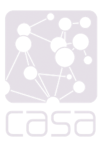

# Estimating Mobility Flows
## Comparative Analysis of Deep Gravity Model and Spatial Interaction Model for non-work flows in London

## Felipe Almeida
University College London - MSc Urban Spatial Science

### Acknowledgements
This project is in partneship with [Fosters and Partners)](https://www.fosterandpartners.com/) supervised by [Professor Elsa Arcaute(UCL/CASA)](https://www.ucl.ac.uk/bartlett/casa/dr-elsa-arcaute) and [Mateo Neira(Fosters and Partners)](https://mateoneira.com/), from [The Bartlett Centre for Advanced Spatial Analysis](https://www.ucl.ac.uk/bartlett/casa/programmes), University College London.

     
